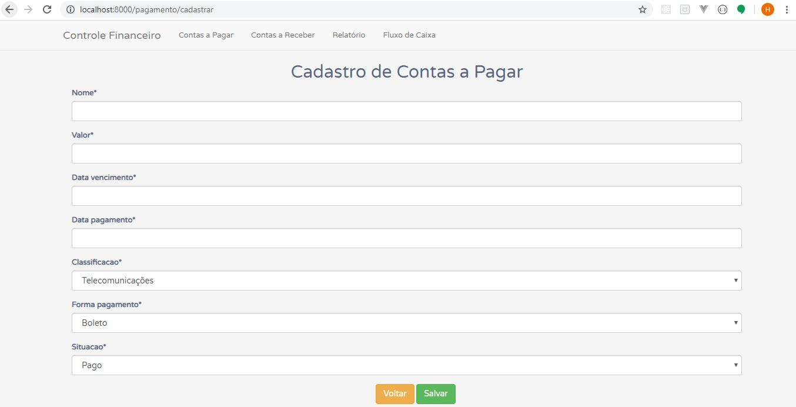
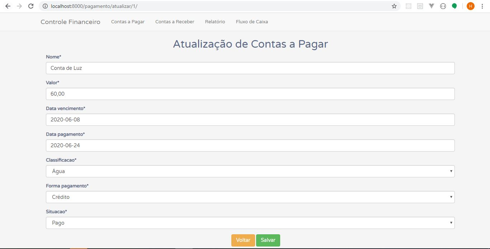
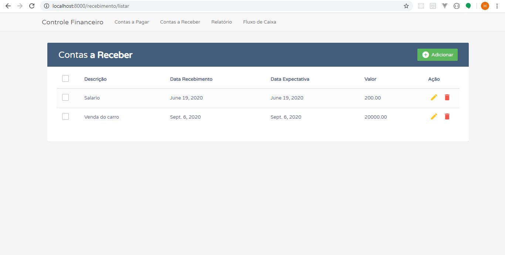
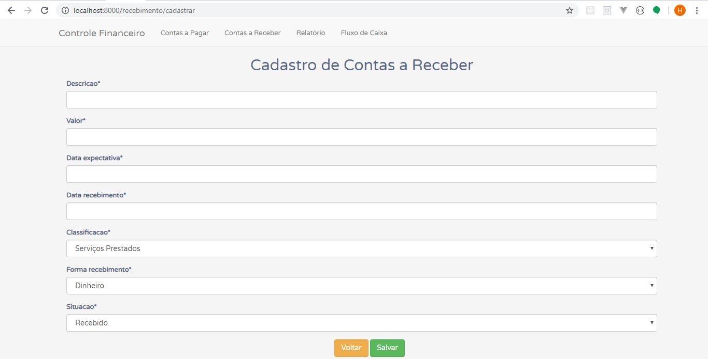
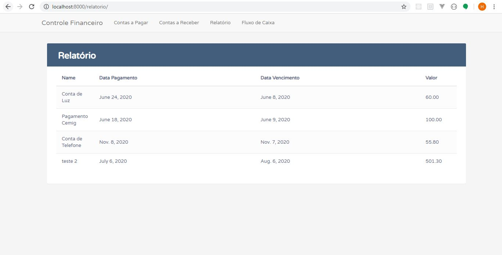
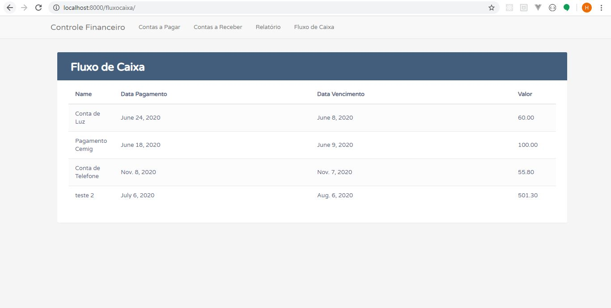

# Trabalho Final Pyton

- Aluno: Hugo Vinicius Reis Vaz
- Curso: Desenvolvimento Web Full Stack

# Imagem do Projeto

- Index: http://localhost:8000/

- Lista Pagamento: http://localhost:8000/pagamento/listar

- Adicionar Pagamento: http://localhost:8000/pagamento/cadastrar

- Editar Pagamento: http://localhost:8000/pagamento/atualizar/1/

- Lista Recebimento: http://localhost:8000/recebimento/listar

- Adicionar Recebimento: http://localhost:8000/recebimento/cadastrar

- Editar Recebimento: http://localhost:8000/recebimento/atualizar/1/

- Relatório: http://localhost:8000/relatorio/

- Fluxo de Caixa: http://localhost:8000/fluxocaixa/

# Comandos Básicos

Para criar um novo virtual env:

$ python -m venv DIRETORIO

Para ativar o virtual env:

Windows:

$ DIRETORIO\Scripts\activate.bat

Linux:

$ DIRETORIO/bin/activate

Não esquecer:

1º - Criar projeto: python manage.py startapp nomeprojeto

2º - Registrar a aplicação no arquivo settings.py array INSTALLED_APPS = ['nomeprojeto']

3º - Criar estrutura do banco de dados: python manage.py migrate

4º - Rodar o projeto: python manage.py runserver

- Criando superuser admin: python manage.py createsuperuser
- http://127.0.0.1:8000/admin/

python manage.py makemigrations => Rodar migração

python manage.py migrate

